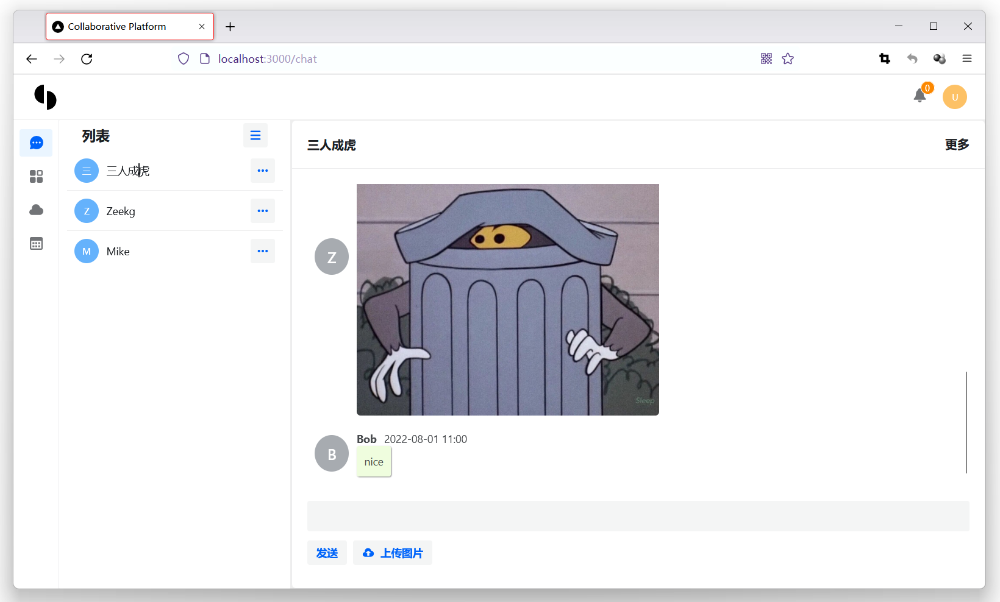
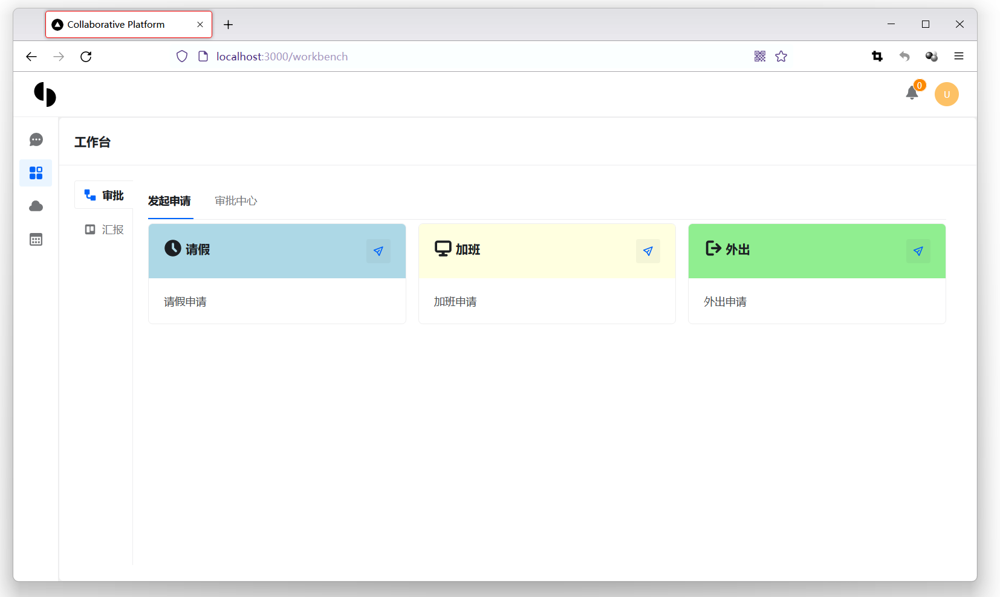
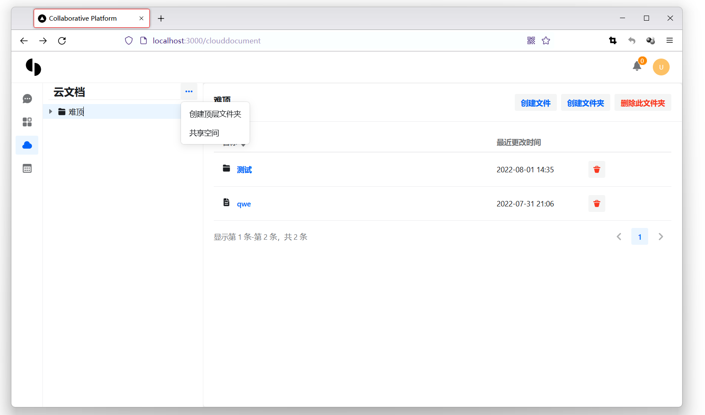
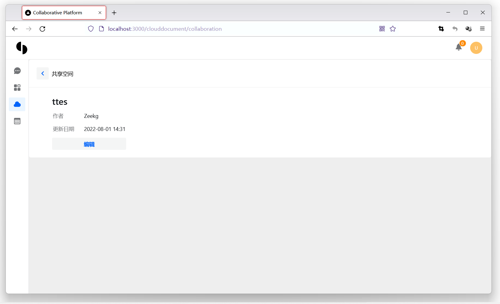
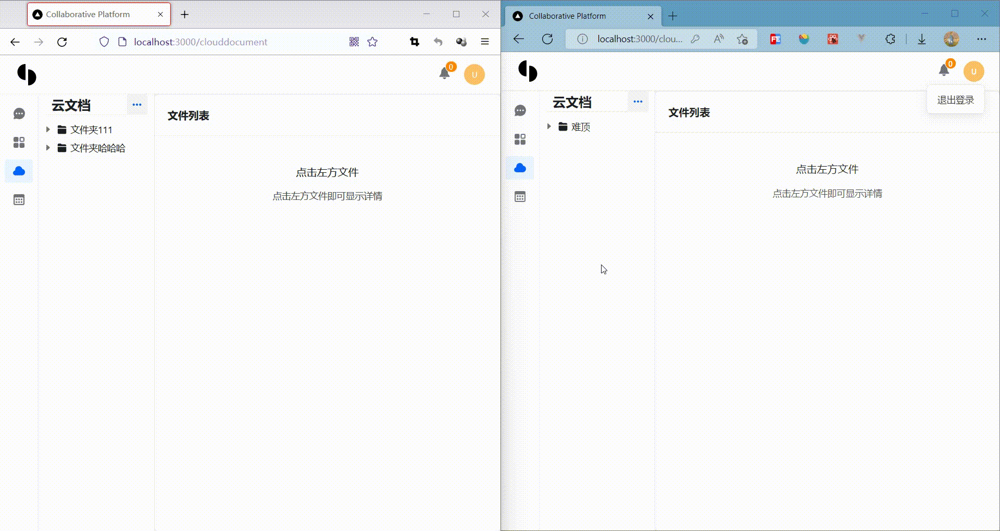

# 团队协作与管理平台

## 介绍

团队协作与管理平台。

- 多人在线聊天（支持发送图片）
- 消息实时推送
- 支持多人协作文档（使用 Quill 富文本编辑器）
- 审批与汇报功能
- 等等...

前端使用 [NextJS 12.2.0](https://nextjs.org/)，后端使用 [NestJS 8.0](https://nestjs.com/)

[详细介绍](https://github.com/Zeekg-zk/Collaborative-Platform/wiki/Document)


## 技术栈


## 项目目录结构

- `client`：web端
- `server`：服务端


## 项目启动

因为前端有涉及到 ali-oss 的 `accessKeyId` 等，后端也有 MySQL 的环境配置等，所以将比如：前端有 `evnt.ts` 未开源，后端有 `.env` 未开源。

不过大致配置如下：

```ts
// 前端的 ent.ts

/**
 * 阿里云的 OSS 配置文件
 */
export const OSSoptions = {
  region: "XXX",
  accessKeyId: "XXX",
  accessKeySecret: "XXX",
  bucket: "XXX",
};

```

```.env
# 后端的 .env

# 与 MySQL 连接的配置
DATABASE_URL="mysql://[连接名]:[密码]@[主机名]:[端口]/[表名]?schema=public"
# 与登录相关
SECRET_KEY="XXX"
```

当上面都配置完成后。

```shell
# 安装依赖（前后端）
yarn

# 运行
yarn dev       # 前端
yarn start:dev # 后端
```


## 部分项目演示

### 在线聊天



### 工作台




### 在线文档





### 协同编辑




